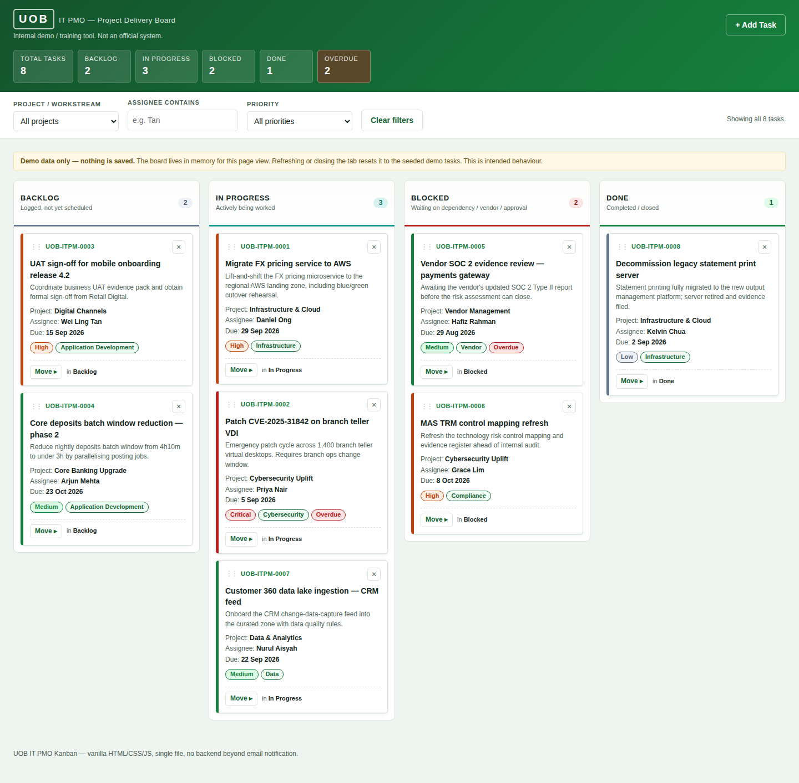

# UOB IT PMO — Project Kanban Board

A single-page Kanban board for tracking IT project delivery, built as an internal demo and training tool.
Everything lives in one `index.html` — no build step, no dependencies, no server. Open the file and it runs.

> This is an unofficial demo. It uses a plain text wordmark, carries no real logos or trademarks, and does
> not imitate any production system. All task data is fictional.



## Features

- **Four fixed columns** — Backlog, In Progress, Blocked, Done — each with a live count badge.
- **Drag and drop** between columns via the native HTML5 API, with a drop-target highlight, plus a
  keyboard-accessible `Move ▸` menu on every card so the board works without a mouse.
- **Cards** show task ID, title, project, assignee, priority, due date and category, colour-coded on the
  left border by priority. Overdue tasks (past due and not Done) get a red badge.
- **Add Task form** with client-side validation, inline field errors, and `UOB-ITPM-####` ID generation.
  New cards appear immediately while the email notification is still in flight.
- **Filter bar** over project, assignee (contains) and priority, plus a live header summary strip
  including an overdue count.
- **Inline delete confirmation** — a "Delete? Yes / No" toggle inside the card, never a native dialog.
- **Responsive** — four columns on desktop, stacked below 768px.
- **Accessible** — semantic landmarks, labelled inputs, visible focus rings, `aria-live` toasts, and
  priority conveyed by text as well as colour.

## Running it

```
open index.html          # macOS
xdg-open index.html      # Linux
```

Or just double-click the file. There is no dev server and no install step.

## Nothing is saved

Board state lives in a JavaScript array in memory. No `localStorage`, `sessionStorage`, IndexedDB or
cookies are used anywhere. **Refreshing the page resets the board to the seeded demo tasks** — this is
intended, and the yellow note in the app says so.

## Email notification

New tasks are posted to [FormSubmit](https://formsubmit.co) via its AJAX JSON endpoint, so the page never
navigates away. The address lives in one place, at the top of the script:

```js
const FORMSUBMIT_ENDPOINT = "https://formsubmit.co/ajax/YOUR_EMAIL@example.com";
```

Swap in a real address to enable it. FormSubmit requires a **one-time activation**: the first submission
triggers a confirmation email, and nothing is delivered until the link in it is clicked. Until then — and
whenever the call fails — the board keeps the card and shows a warning toast. A notification failure never
blocks or breaks the board.

## Deployment

`.github/workflows/deploy-pages.yml` publishes the board to GitHub Pages on push to the default branch.
There is nothing to build: the job copies `index.html` into `_site/` and uploads it as the Pages artifact.

Pages must be switched on once by hand at **Settings → Pages → Source: GitHub Actions**. The Actions token
cannot create a Pages site itself, so the workflow fails with `Resource not accessible by integration`
until that is done. Note that GitHub Pages is unavailable for **private** repositories on the Free plan —
the repository has to be public, or the account on a paid plan.

## Security

The app is client-side and unauthenticated, so the threat model is narrow: cross-site scripting through the
rendering path, and self-inflicted denial of service. Controls in place:

- **Output escaping.** Every user-supplied string passes through `escapeHtml()` before reaching `innerHTML`.
- **Hash-pinned CSP.** A `Content-Security-Policy` meta tag with `default-src 'none'` pins the inline
  `<style>` and `<script>` by SHA-256. An injected script tag will not execute and a request to any host
  other than `formsubmit.co` is refused — a second layer that holds even if the escaping were bypassed.
  Run `python3 tools/csp-hash.py` after editing either inline block, or the page loads inert.
- **`no-referrer`** so the page URL never leaks to the notification endpoint.
- **Bounded resources.** A cap on board size, a throttle between submissions, and a timeout on the
  outbound request so a hung third party cannot wedge the form.
- **Control-character stripping** on form input before it enters state.

Two gaps are known and deliberate: `frame-ancestors` is ignored in a `<meta>` CSP, so clickjacking
protection needs a real HTTP header; and the notification endpoint accepts unauthenticated posts from
anyone, which is out of scope for a demo with no backend.

## Development

`index.html` is the only *application* source file. All markup, CSS and JavaScript stay in it — do not
split it into separate files. (`tools/csp-hash.py` is a development helper, not shipped code, and the
deployed site contains nothing but `index.html`.) The app ships no external resources: no CDN scripts, no web fonts, no image files. Icons
are Unicode glyphs or inline SVG, and the favicon is a `data:` URI.

The screenshot above is repository documentation, not an app asset — nothing in `index.html` references it.

State is a single `state = { tasks, filters, ui }` object. `renderBoard()` rebuilds the board from state on
every change, so card contents are never mutated directly. Every user-supplied string passes through
`escapeHtml()` before reaching `innerHTML`.

See [`CLAUDE.md`](CLAUDE.md) for the full architecture notes and the constraints that shape the code.
